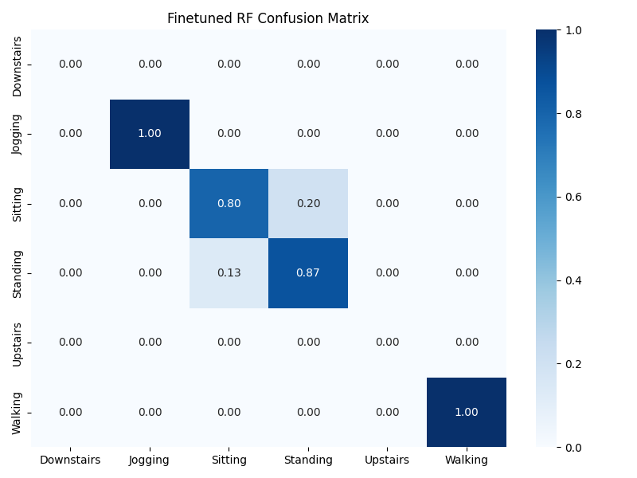

# HAR Fine-tuning Report

## Comparison Metrics

| Model | Accuracy | Macro-F1 |
| :--- | :--- | :--- |
| RF Baseline | 0.5200 | 0.3750 |
| RF Finetuned | 0.8933 | 0.9055 |
| DL Baseline | 0.3067 | 0.2391 |
| DL Finetuned | 0.6800 | 0.7222 |

## Visualizations
- 
- 
